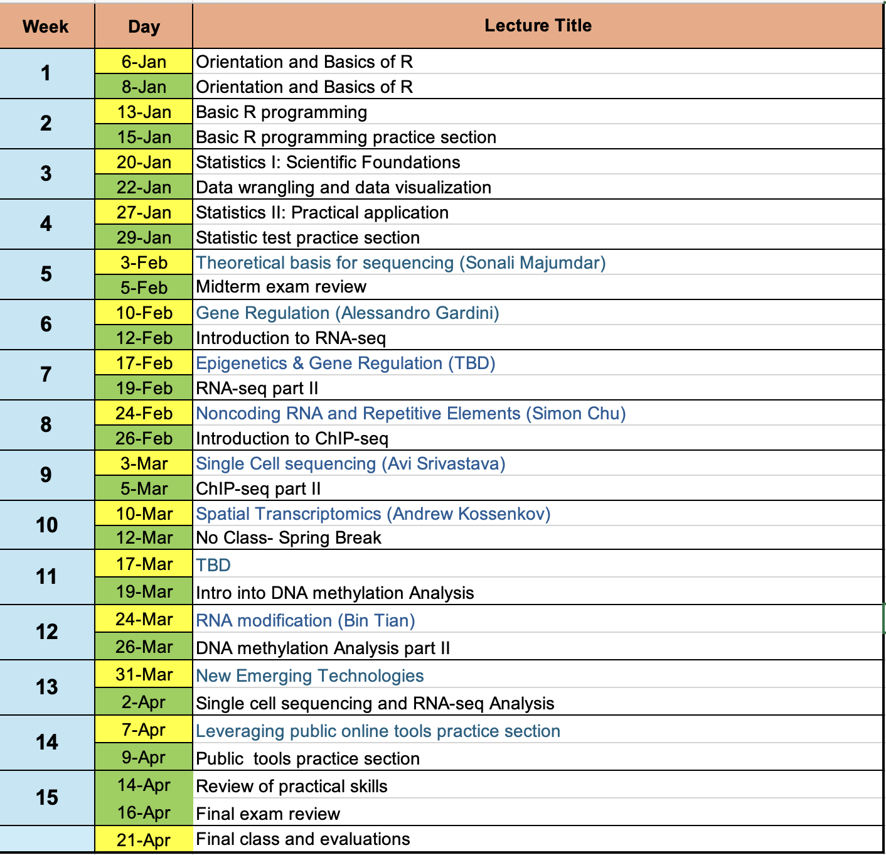

# Wistar Bioinformatics Class Spring 2026

The Wistar Bioinformatics Class is a 15-week research training program for PCOM students interested in learning scientific biological data analysis.

------------------------------------------------------------------------

## Schedule

### Webpage mirror

[Bioinfo Class Spring 2026](https://wistar-bioinfo.github.io/BioinfoClass_Spring_2026)

------------------------------------------------------------------------

Zoom lint to BIOM 643

Bioinformatics - Tuesdays 2-3:30
   <https://pcom.zoom.us/j/95474182052?pwd=zYZpNnN0hOQe2VcqaVoZmAbMJAriL5.1>

Bioinformatics - Thursdays 2-3:30
   <https://pcom.zoom.us/j/94375316257?pwd=0K4oCIOIa60iaoJhbGxdVdXFMTeHFA.1>

------------------------------------------------------------------------

## Getting Started

### Programs to Install

1. Slack <https://slack.com/> our slack name is `wistar_bioinfo_spring2026`
   Join Slack [bioinfo group](https://join.slack.com/t/clip-c3i6499/shared_invite/zt-3mtm7m24j-VaFvvvcGtTQ5ZksqXr0xtA) or email me [jmadzo@wistar.org](mailto:jmadzo@wistar.org)

   

2. R <https://cloud.r-project.org/> to download and install R.

   

3. RStudio <https://rstudio.com/products/rstudio/download/> and download the FREE version.

------------------------------------------------------------------------

### Lecture Material

#### **Week 1** Orientation and Basics R

##### Welcome and Introduction to Rmarkdown and RStudio

-   Introduction to Bioinformatics Research
-   Introduction to Rmarkdown and RStudio
-   [slides](week1/Bioinfo_class_week1_01_06_2026.pdf)
-   demo `dplyr` / `tidyverse` [qmd](week1/2026-01-08_dplyr_demo.Rmd )

------------------------------------------------------------------------

<!---
-   more resource about [Markdown](https://www.markdownguide.org/cheat-sheet/)

-   demo MarkDown [qmd](week1/week1/2026-01-08_dplyr_demo.Rmd )
-   in class notebook [qmd](2026-01-08_dplyr_in_class.qmd)
-   html version [html](2026-01-08_dplyr_in_class.html)

--->