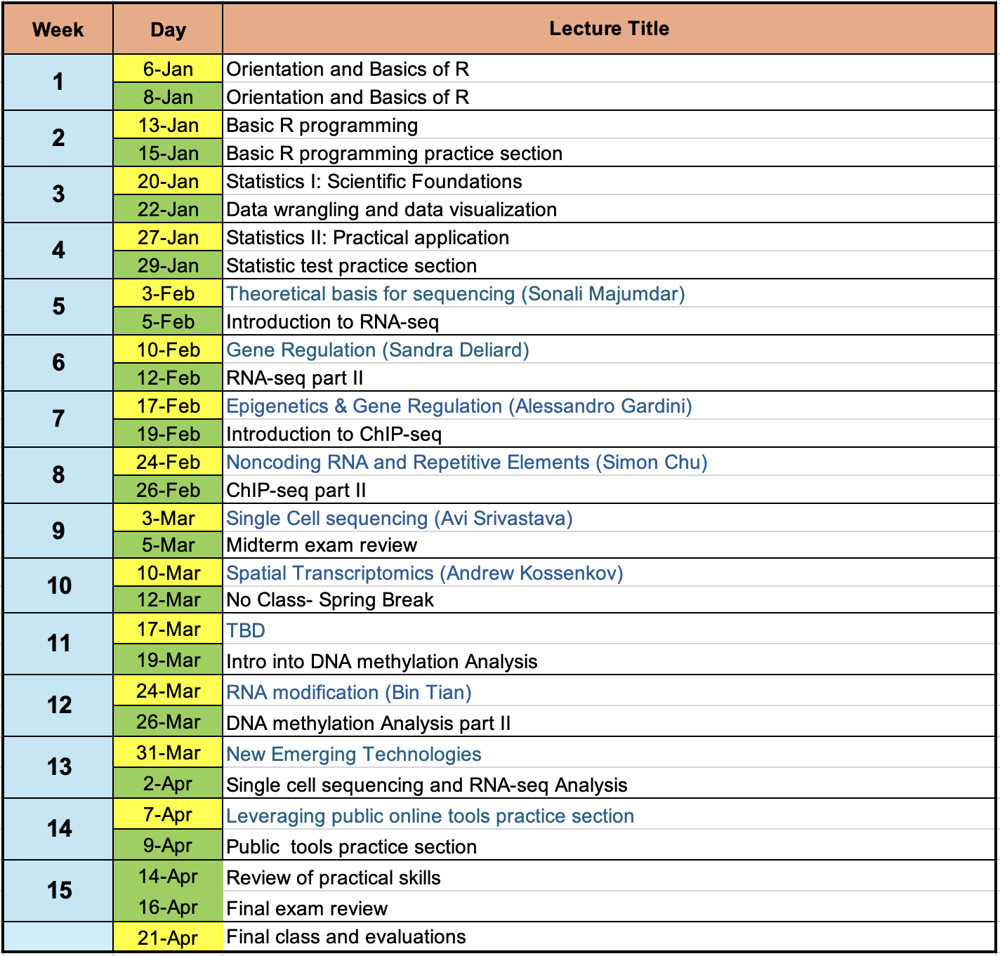

# Wistar Bioinformatics Class Spring 2026

The Wistar Bioinformatics Class is a 15-week research training program for PCOM students interested in learning scientific biological data analysis.

------------------------------------------------------------------------

## Schedule

### [Webpage mirror Bioinfo Class Spring 2026](https://wistar-bioinfo.github.io/BioinfoClass_Spring_2026)

#### [GitHub mirror Bioinfo Class Spring 2026](https://github.com/Wistar-bioinfo/BioinfoClass_Spring_2026)

------------------------------------------------------------------------

__Zoom lint to BIOM 643__

Bioinformatics - _Tuesdays 2-3:30_
   <https://pcom.zoom.us/j/95474182052?pwd=zYZpNnN0hOQe2VcqaVoZmAbMJAriL5.1>

Bioinformatics - _Thursdays 2-3:30_
   <https://pcom.zoom.us/j/94375316257?pwd=0K4oCIOIa60iaoJhbGxdVdXFMTeHFA.1>

------------------------------------------------------------------------

## Getting Started

### Programs to Install

1. <b>Slack</b> <https://slack.com/> our slack name is `wistar_bioinfo_spring2026`
   Join Slack [bioinfo group](https://join.slack.com/t/clip-c3i6499/shared_invite/zt-3mtm7m24j-VaFvvvcGtTQ5ZksqXr0xtA) or email me [jmadzo@wistar.org](mailto:jmadzo@wistar.org)

   

2. <b> R: </b> <https://cloud.r-project.org/> to download and install R.

   

3. <b> RStudio: </b> <https://rstudio.com/products/rstudio/download/> and download the FREE version.

------------------------------------------------------------------------

### Lecture Material

#### **Week 1** Orientation and Basics R

##### Welcome and Introduction to Rmarkdown and RStudio

-   Introduction to Bioinformatics Research
-   Introduction to Rmarkdown and RStudio
-   [slides](week1/Bioinfo_class_week1_01_06_2026.pdf)
-   demo `dplyr` / `tidyverse` [qmd](week1/2026-01-08_dplyr_demo.Rmd )

-   in class changes notebook [qmd](week1/2026-01-08_dplyr_in_class.qmd)
-   html version [html](week1/2026-01-08_dplyr_in_class.html)

------------------------------------------------------------------------

#### **Week 2** Markdown and more  Basics R 

##### Markdown
resource about [Markdown](https://www.markdownguide.org/cheat-sheet/)

-   html version [html](week2/BioinfoClass_2026_week2_rmarkdown.html)

-   MarkDown notebook demo [qmd](week2/BioinfoClass_2026_week2_rmarkdown.qmd)

##### Data organization and Plotting in R

-   [slides](week2/Bioinfo_class_week2_2026.pdf)
-   notebook demo [qmd](week2/Plotting_in_R_Introduction_demo.qmd)
-   html version [html](week2/Plotting_in_R_Introduction_demo.html)

------------------------------------------------------------------------

#### **Week 3:** Statistics I: Scientific Foundations

##### Tuesday

-   [slides](week3/Bioinfo_class_week3_spring_2026.pdf)

##### Thursday:  practice section on basic statistic
-   notebook demo [qmd](week3/Intro_to_Stats_week3.qmd) 
-   html version [html](week3/Intro_to_Stats_week3.html)

- R color palette [pdf](week3/ColorChart.pdf)

------------------------------------------------------------------------

#### **Week 4:**

##### Tuesday - Statistics II: Clustering and Linear Model

-   [slides](week4/Clustering_LM_week4.pdf)

##### Thursday - practice section on basic statistic continue

-   demo Clustering [qmd](week4/Clustering_week4.qmd) and its [html](week4/Clustering_week4.html)

-   demo LM [qmd](week4/LinearModels_week4.qmd) and its [html](week4/LinearModels_week4.html)

----

#### **Week 5:** Introduction to Next Generation Sequencing

##### Tuesday - Theoretical basis for sequencing

-   [slides](week5/Lecture_SonaliMajumdar_spring_2026.pdf) lecture presented by *__Sonali Majumdar__* (_Managing Director, Genomics Facility at Wistar Institute_)

##### Thursday - Introduction to RNA-seq

-   [slides](week5/Bioinfo_class_week5_Intro_to_RNAseq.pdf) theory behind RNA-seq

-----

#### **Week 6:** Gene Regulation

##### Tuesday - Overview of Regulation of Gene expression

- [slides](week6/Bioinfo_class_week6_Gene_Regulation_Sandra_Deliard.pdf) lecture presented by *__Sandra Deliard__* (_Associate Staff Scientist at Wistar Institute_)

##### Thursday - RNAseq practice

- [notebook](week6/Intro_RNAseq_dge.qmd)
- [data](week6/data/TCGA_PRAD_counts.tsv.gz)
- [metadata](week6/data/TCGA_PRAD_metadata.csv)

-----

#### Week 7: Gene Regulation II

##### Tuesday - Epigenetic Regulation of Gene expression

- [slides](week7/Bioinfo_class_week7_AleGardini_EpiRegulationofTranscription2026.pdf) lecture presented by *__Alessandro Gardini__* (_Associate Professor, Genomics Facility Scientific Director  Wistar Institute_)

##### Thursday -  Stats of RNAseq: PCA / Linear Models
###### PCA practice
- [PCA](week7/PCA_w_prcomp_vs_PCAtools.qmd)
##### T-test vs. Linear models
- [t-test vs lm](week7/Common_stat_test_LM.qmd)

##### Common Statistical tests are LMs (Linear Models)
- [how to teach stat](https://lindeloev.github.io/tests-as-linear/)

-----

#### Week 8: Non-coding RNA

##### Tuesday - Non-coding RNA and Transposable Elements (TE)

- [slide](week8/Bioinfo_class_week8_SimonChu_NonCodingRNA_and_TEs.pdf) lecture presented by *__Simon Chu__* (_Caspar Wistar Fellow, Wistar Institute_)

##### Thursday - midterm review  
- practice part 1

#### Week 9: Example of Machine Learning on biological datasets

##### Tuesday - Machine Learning on datasets of hERV
- [slide](week9/missing_file.pdf) lecture presented by *__Andrew Patterson__* (_Computational Biologist, Wistar Institute_)

##### Thursday - midterm review
- practice part 2

------------------------------------------------------------------------

### Midterm assigment

#### Exampe RStudio files

-   data files:
    -   [wine_data_set](midterm/data/wine_data_set.tsv)

notebook
-   [qmd](midterm/Example_for_midterm.qmd)
-   [html](midterm/Example_for_midterm.html)

#### Assigment

fill in this quarto markdown (qmd) template file with your answers and send it to me
- [qmd blank](midterm/exam_spring_2026_blank.qmd)
- [html blank](midterm/exam_spring_2026_blank.html)

- data files: you will need to download folowing data:
    - [mice_weights_and_diet](midterm/data/mice_weights_and_diet.tsv)
    - [tissue_gene_expression](midterm/data/tissue_gene_expression.tsv)

------------------------------------------------------------------------

##### Please, send me back your filled up Quarto Markdown (qmd) document to [jmadzo@wistar.org](mailto:jmadzo@wistar.org)

##### notes:

-   please, provide verbal answer (one sentence) for statatistical questions: 
Is there or isn't there statistically significant difference in values/parameters/features you testing

-   beside qmd file, try to make html document as well (it will be useful for your future reference)

------------------------------------------------------------------------

#### Solution:
here will be expected solution in [html](midterm/exam_spring_2026.html)

------------------------------------------------------------------------

